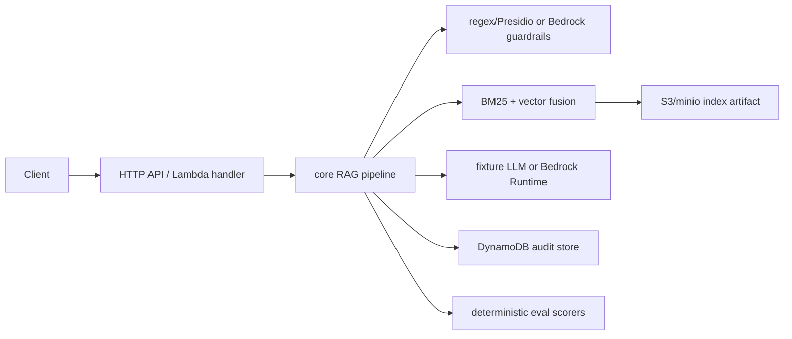

# Building block view

Core packages map directly to `packages/core/src`; local adapters to `packages/adapters-local/src`; AWS adapters to `packages/adapters-aws/src`; infrastructure to `infra/cdk/lib`.
