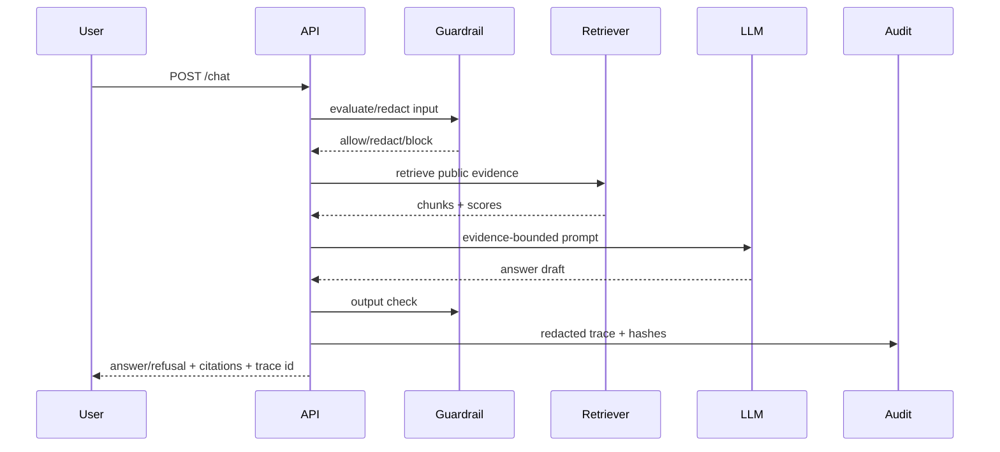

# Runtime view

## Chat sequence

Failure branches: missing index returns a safe error/refusal; Bedrock timeout becomes a model error with trace id; unsafe eval trigger is refused before model calls.
