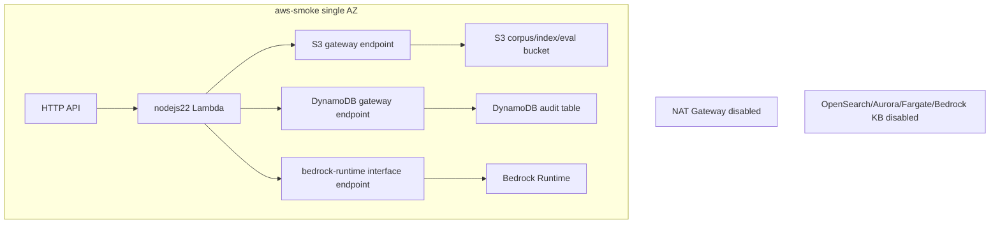

# Deployment view

```mermaid
flowchart TB
  subgraph aws-smoke single AZ
    API[HTTP API] --> Lambda[nodejs22 Lambda]
    Lambda --> S3EP[S3 gateway endpoint]
    Lambda --> DDBEP[DynamoDB gateway endpoint]
    Lambda --> BREP[bedrock-runtime interface endpoint]
    S3EP --> S3[S3 corpus/index/eval bucket]
    DDBEP --> DDB[DynamoDB audit table]
    BREP --> Bedrock[Bedrock Runtime]
  end
  X1[NAT Gateway disabled]
  X2[OpenSearch/Aurora/Fargate/Bedrock KB disabled]
```

Commands: `pnpm cdk:synth:smoke`, `pnpm cdk:nag`, `scripts/aws-smoke-run.sh`.
