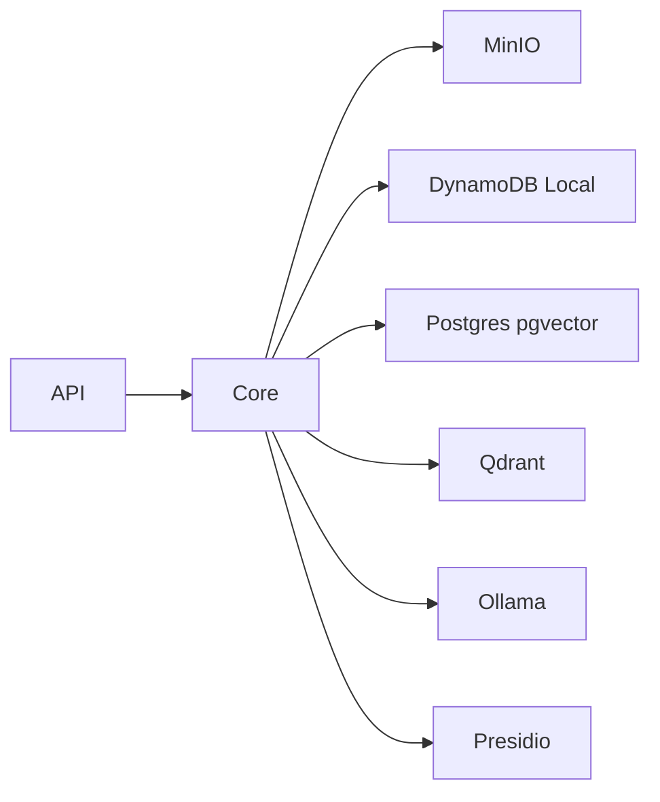
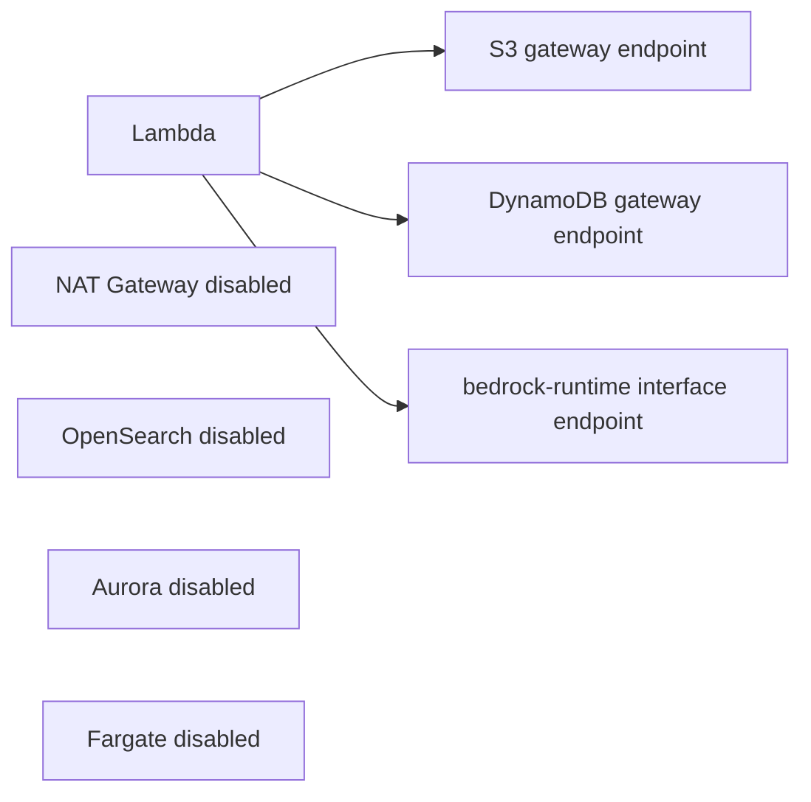
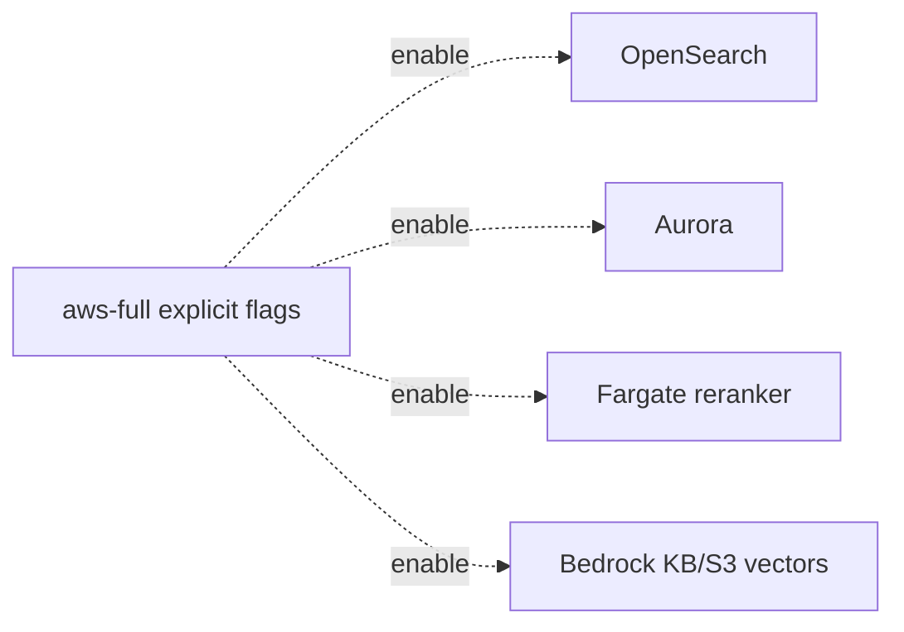

# Architecture diagrams

## Local OSS demo

```mermaid
flowchart LR
  API --> Core
  Core --> MinIO
  Core --> DDBLocal[DynamoDB Local]
  Core --> Pg[Postgres pgvector]
  Core --> Qdrant
  Core --> Ollama
  Core --> Presidio
```

## AWS smoke

```mermaid
flowchart LR
  Lambda --> S3Gateway[S3 gateway endpoint]
  Lambda --> DdbGateway[DynamoDB gateway endpoint]
  Lambda --> BedrockRuntime[bedrock-runtime interface endpoint]
  NAT[NAT Gateway disabled]
  OS[OpenSearch disabled]
  Aurora[Aurora disabled]
  Fargate[Fargate disabled]
```

## Prod extension path

```mermaid
flowchart LR
  FullFlags[aws-full explicit flags] -. enable .-> OpenSearch
  FullFlags -. enable .-> Aurora
  FullFlags -. enable .-> Reranker[Fargate reranker]
  FullFlags -. enable .-> KB[Bedrock KB/S3 vectors]
```
